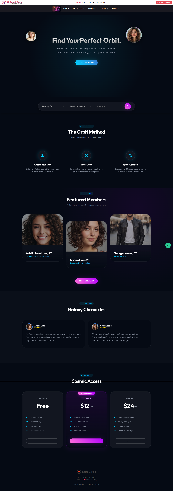
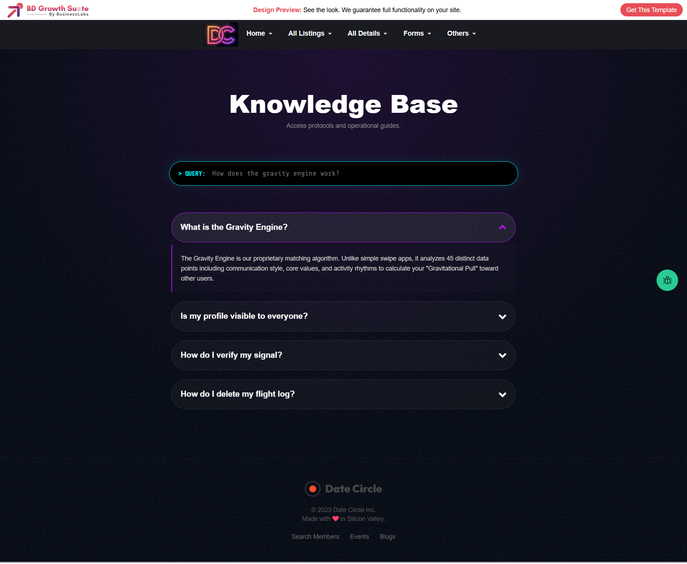
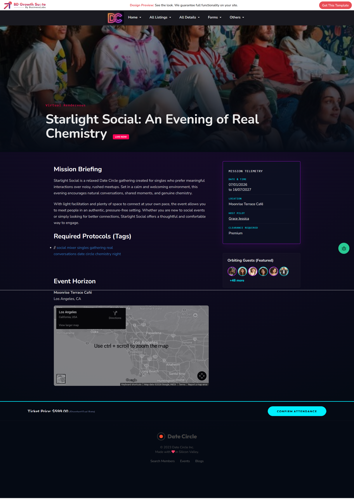
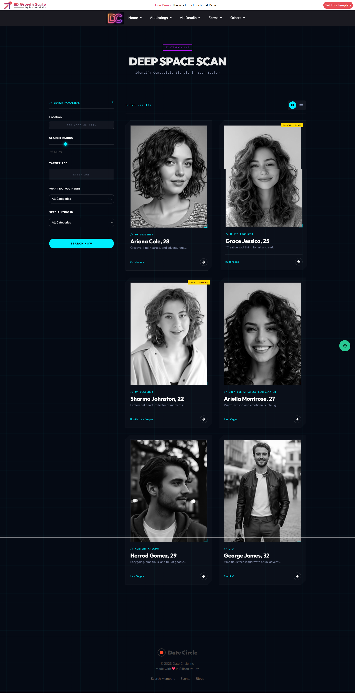
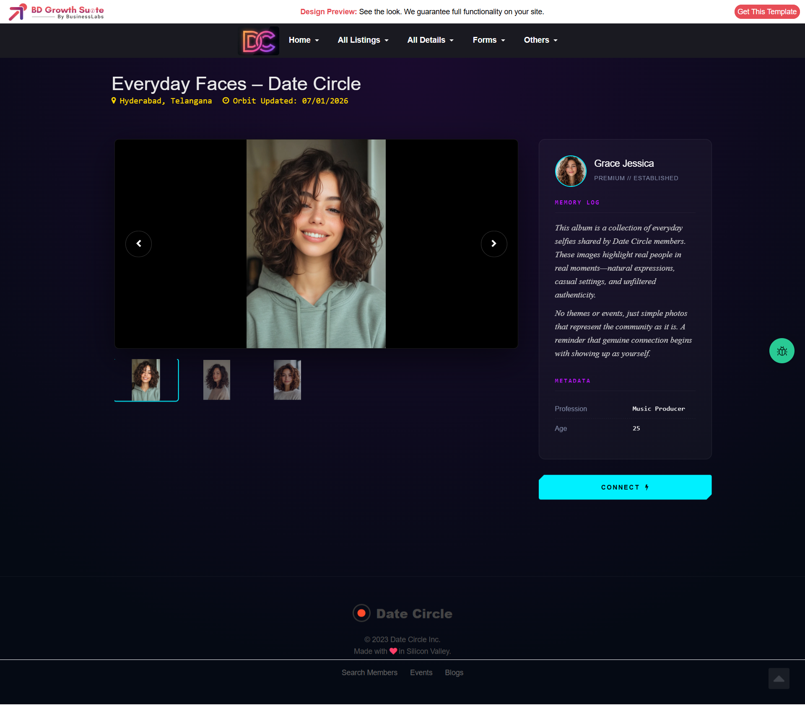
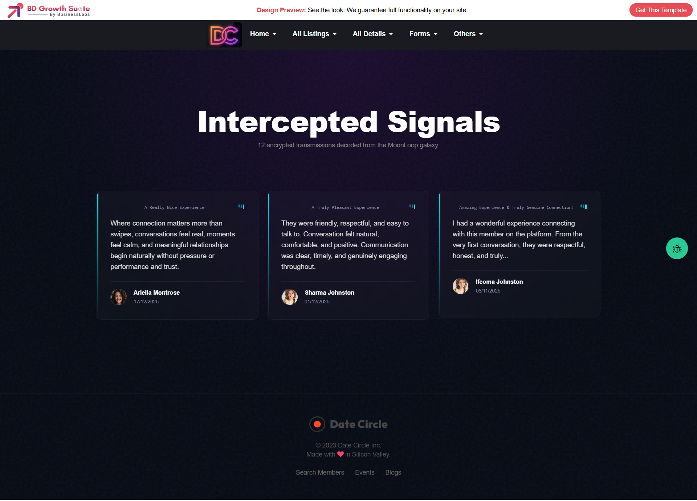

❤️ Date Circle – Dating Site Application

Date Circle is a modern dating platform UI designed to connect people through profiles, blogs, events, photos, and reviews.
This project focuses on a clean user interface, responsive layouts, and structured directory-style dating features.

🚀 Features

Member listing & detailed profile pages

Dating blog system

Events for dating & meetups

Photo galleries

Reviews system

Static informational pages

Fully responsive UI

🛠 Tech Stack

HTML5

CSS3

Bootstrap

PHP

Directory-style UI architecture

📂 Pages Included

Homepage

About Us

How It Works

FAQs

Blog Listing

Blog Detailed

Event Listing

Event Detailed

Member Listing

Member Detailed

Member Reviews

Photos Listing

Photos Detailed
## 🖼 Full Application Screenshots

### Homepage

### About Us Page

### How It Works Page

### FAQs Page

### Blog Listing Page

### Blog Detailed Page

### Event Listing Page

### Event Detailed Page

### Member Listing Page

### Member Detailed Profile Page

### Photos Listing Page

### Photos Detailed Page

### Reviews Page

👨‍💻 Author

T Naresh
Full-Stack & UI Developer

📄 License

This project is created for demo and portfolio purposes.
For commercial usage, please contact the author.
